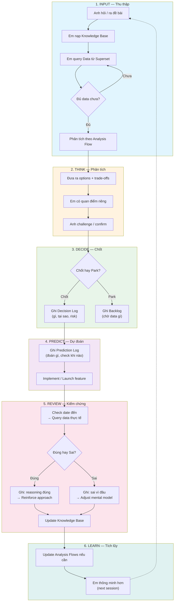
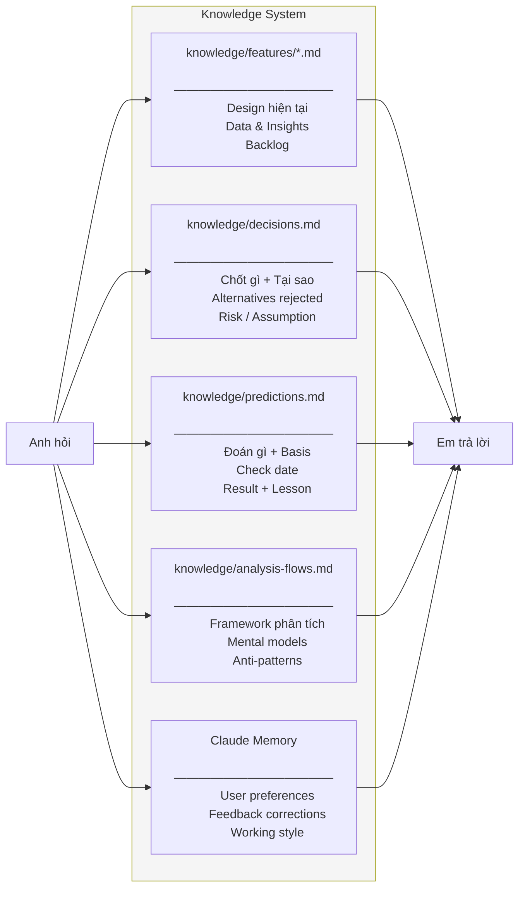
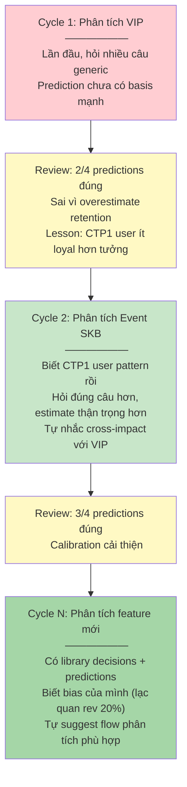
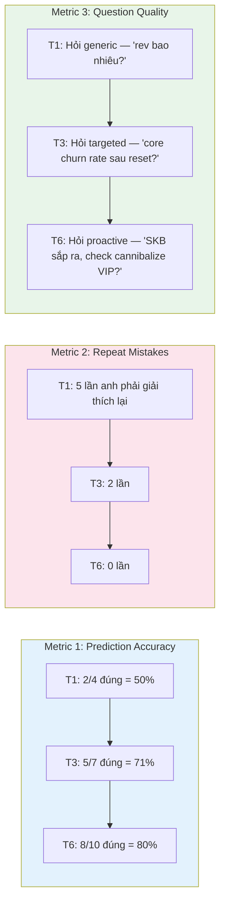

# Second Brain — How It Gets Smarter

## Overview Flow

```mermaid
flowchart TD
    subgraph INPUT["1. INPUT — Thu thập"]
        A1[Anh hỏi / ra đề bài] --> A2[Em nạp Knowledge Base]
        A2 --> A3[Em query Data từ Superset]
        A3 --> A4{Đủ data chưa?}
        A4 -- Chưa --> A3
        A4 -- Đủ --> B1
    end

    subgraph THINK["2. THINK — Phân tích"]
        B1[Phân tích theo Analysis Flow] --> B2[Đưa ra options + trade-offs]
        B2 --> B3[Em có quan điểm riêng]
        B3 --> B4[Anh challenge / confirm]
    end

    subgraph DECIDE["3. DECIDE — Chốt"]
        B4 --> C1{Chốt hay Park?}
        C1 -- Chốt --> C2["Ghi Decision Log
        (gì, tại sao, risk)"]
        C1 -- Park --> C3["Ghi Backlog
        (chờ data gì)"]
    end

    subgraph PREDICT["4. PREDICT — Dự đoán"]
        C2 --> D1["Ghi Prediction Log
        (đoán gì, check khi nào)"]
        D1 --> D2[Implement / Launch feature]
    end

    subgraph REVIEW["5. REVIEW — Kiểm chứng"]
        D2 --> E1["Check date đến
        → Query data thực tế"]
        E1 --> E2{Đúng hay Sai?}
        E2 -- Đúng --> E3["Ghi: reasoning đúng
        → Reinforce approach"]
        E2 -- Sai --> E4["Ghi: sai vì đâu
        → Adjust mental model"]
        E3 --> F1
        E4 --> F1
    end

    subgraph LEARN["6. LEARN — Tích lũy"]
        F1[Update Knowledge Base] --> F2[Update Analysis Flows nếu cần]
        F2 --> F3["Em thông minh hơn
        (next session)"]
        F3 -.-> A1
    end

    style INPUT fill:#e1f5fe
    style THINK fill:#fff3e0
    style DECIDE fill:#e8f5e9
    style PREDICT fill:#f3e5f5
    style REVIEW fill:#fce4ec
    style LEARN fill:#e0f2f1
```

## Chi tiết: Cái gì lưu ở đâu?

```mermaid
flowchart LR
    subgraph STORAGE["Knowledge System"]
        KB["knowledge/features/*.md
        —————————————
        Design hiện tại
        Data & Insights
        Backlog"]

        DL["knowledge/decisions.md
        —————————————
        Chốt gì + Tại sao
        Alternatives rejected
        Risk / Assumption"]

        PL["knowledge/predictions.md
        —————————————
        Đoán gì + Basis
        Check date
        Result + Lesson"]

        AF["knowledge/analysis-flows.md
        —————————————
        Framework phân tích
        Mental models
        Anti-patterns"]

        MM["Claude Memory
        —————————————
        User preferences
        Feedback corrections
        Working style"]
    end

    Q[Anh hỏi] --> KB
    Q --> DL
    Q --> PL
    Q --> AF
    Q --> MM

    KB --> ANS[Em trả lời]
    DL --> ANS
    PL --> ANS
    AF --> ANS
    MM --> ANS

    style STORAGE fill:#f5f5f5
```

## Feedback Loop — Thông minh hơn qua từng cycle

```mermaid
flowchart TD
    C1["Cycle 1: Phân tích VIP
    ——————
    Lần đầu, hỏi nhiều câu generic
    Prediction chưa có basis mạnh"] 
    
    --> R1["Review: 2/4 predictions đúng
    Sai vì overestimate retention
    Lesson: CTP1 user ít loyal hơn tưởng"]
    
    --> C2["Cycle 2: Phân tích Event SKB
    ——————
    Biết CTP1 user pattern rồi
    Hỏi đúng câu hơn, estimate thận trọng hơn
    Tự nhắc cross-impact với VIP"]
    
    --> R2["Review: 3/4 predictions đúng
    Calibration cải thiện"]
    
    --> C3["Cycle N: Phân tích feature mới
    ——————
    Có library decisions + predictions
    Biết bias của mình (lạc quan rev 20%)
    Tự suggest flow phân tích phù hợp"]

    style C1 fill:#ffcdd2
    style R1 fill:#fff9c4
    style C2 fill:#c8e6c9
    style R2 fill:#fff9c4
    style C3 fill:#a5d6a7
```

## Đo lường: 3 metrics

```mermaid
flowchart LR
    subgraph M1["Metric 1: Prediction Accuracy"]
        direction TB
        PA1["T1: 2/4 đúng = 50%"]
        PA2["T3: 5/7 đúng = 71%"]
        PA3["T6: 8/10 đúng = 80%"]
        PA1 --> PA2 --> PA3
    end

    subgraph M2["Metric 2: Repeat Mistakes"]
        direction TB
        RM1["T1: 5 lần anh phải giải thích lại"]
        RM2["T3: 2 lần"]
        RM3["T6: 0 lần"]
        RM1 --> RM2 --> RM3
    end

    subgraph M3["Metric 3: Question Quality"]
        direction TB
        QQ1["T1: Hỏi generic — 'rev bao nhiêu?'"]
        QQ2["T3: Hỏi targeted — 'core churn rate sau reset?'"]
        QQ3["T6: Hỏi proactive — 'SKB sắp ra, check cannibalize VIP?'"]
        QQ1 --> QQ2 --> QQ3
    end

    style M1 fill:#e3f2fd
    style M2 fill:#fce4ec
    style M3 fill:#e8f5e9
```
